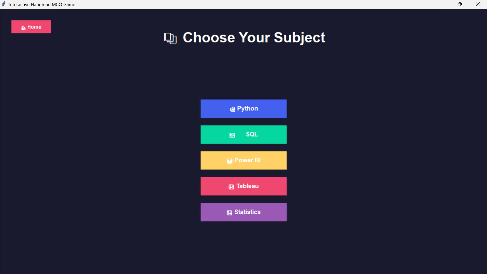

# 🎯 Interactive Hangman MCQ Game

An engaging educational game that combines the classic Hangman concept with multiple-choice questions across various programming and data science subjects.


## 🌟 Features

- **Multiple Subjects**: Python, SQL, Power BI, Tableau, and Statistics
- **Three Difficulty Levels**: Easy, Intermediate, and Extreme
- **Interactive Hangman**: Visual feedback with progressive hangman drawing
- **Sound Effects**: Immersive audio experience with custom sounds
- **Video Celebrations**: MP4 video playback for perfect scores
- **Timer Challenge**: 15-second countdown per question
- **Smart Feedback**: Real-time feedback for incorrect attempts
- **Cross-Platform**: Works on Windows, macOS, and Linux

## 🎮 Game Flow

1. **Welcome Screen**: Enter your nickname
2. **Subject Selection**: Choose from 5 different subjects
3. **Difficulty Selection**: Pick Easy, Intermediate, or Extreme
4. **MCQ Challenge**: Answer questions within the time limit
5. **Results**: View your performance with visual feedback

## 📋 Game Rules

- ✅ **Correct Answer**: +2 points, move to next question
- ❌ **Wrong Selection**: Try again within the same question (no hangman penalty)
- ⏰ **Timeout**: Hangman body part added, no points, move to next
- 💀 **Game Over**: 6 timeouts complete the hangman (game ends)
- 🎉 **Perfect Score**: Special celebration with video animation

## 🚀 Quick Start

### Prerequisites

- Python 3.7 or higher
- tkinter (usually included with Python)

### Installation

1. **Clone the repository:**
   ```bash
   git clone https://github.com/yourusername/hangman-mcq-game.git
   cd hangman-mcq-game
   ```

2. **Install dependencies:**
   ```bash
   pip install -r requirements.txt
   ```
   
   Or use the setup script:
   ```bash
   python setup.py --install
   ```

3. **Run the game:**
   ```bash
   python hangman_game.py
   ```

### Option 2: Virtual Environment (Isolated)
```bash
python setup.py --venv myenv
# Activate the environment:
# Windows: myenv\Scripts\activate
# macOS/Linux: source myenv/bin/activate
pip install -r requirements.txt
```

### Option 3: Manual Installation
```bash
pip install pygame>=2.0.0 numpy>=1.19.0
# Optional for video support:
pip install opencv-python>=4.5.0 Pillow>=8.0.0
```

## 📦 Dependencies

### Core Dependencies
- **pygame**: Sound effects and audio management
- **numpy**: Fallback sound generation
- **tkinter**: GUI framework (usually included with Python)

### Optional Dependencies
- **opencv-python**: Video playback support
- **Pillow**: Image processing for video frames

## 🎨 Game Screenshots

| Welcome Screen | Subject Selection | Difficulty Levels |
|----------------|-------------------|-------------------|
|  |  |  |

| MCQ Interface | Countdown Alert | Perfect Score |
|---------------|-----------------|---------------|
|  |  |  |

## 🎵 Audio Features

The game includes custom sound effects for:
- 🎵 **Start**: Game initialization
- ⏰ **Countdown**: Final 5 seconds warning
- 💰 **Coin**: Correct answer reward
- ❌ **Wrong**: Incorrect attempt feedback
- 🎉 **Celebration**: Perfect score achievement
- 😢 **Crying**: Game over scenario

## 📚 Question Bank

### Subjects Available:
- **🐍 Python**: Programming fundamentals to advanced concepts
- **🗃️ SQL**: Database queries and management
- **📊 Power BI**: Data visualization and business intelligence
- **📈 Tableau**: Advanced data visualization
- **📉 Statistics**: Mathematical statistics and data analysis

### Difficulty Levels:
- **🟢 Easy**: Basic concepts and fundamentals
- **🟡 Intermediate**: Applied knowledge and practical skills
- **🔴 Extreme**: Advanced topics and expert-level challenges

## 🔧 Troubleshooting

### Common Issues

**"pygame not found" error:**
```bash
pip install pygame
```

**"No module named 'tkinter'" error:**
- **Ubuntu/Debian**: `sudo apt-get install python3-tk`
- **macOS**: Usually included; try `brew install python-tk`
- **Windows**: Usually included with Python installer

**Sound not playing:**
- Ensure pygame is properly installed
- Check if sound files exist in `assets/files/sounds/`
- Try running the dependency test: `python setup.py --install`

**Video not playing:**
```bash
pip install opencv-python Pillow
```

### Performance Tips

- Close other audio applications if sound issues occur
- For slower systems, disable video by removing opencv-python
- Use virtual environment for isolated dependencies

## 🧪 Testing

Test your installation:
```bash
python setup.py --install
# This will run dependency checks automatically
```

Manual test:
```bash
python -c "import pygame, numpy, tkinter; print('Core dependencies OK')"
python -c "import cv2, PIL; print('Video support OK')"  # Optional
```

## 🎯 Game Strategy

- **Time Management**: Each question has 15 seconds
- **Smart Guessing**: Wrong attempts don't add hangman parts
- **Risk vs Reward**: Take time to think, but don't timeout
- **Subject Mastery**: Start with Easy to build confidence

## 🤝 Contributing

1. Fork the repository
2. Create a feature branch (`git checkout -b feature/amazing-feature`)
3. Commit your changes (`git commit -m 'Add amazing feature'`)
4. Push to the branch (`git push origin feature/amazing-feature`)
5. Open a Pull Request

### Contributing Guidelines
- Add questions to the question bank in `hangman_game.py`
- Include sound files in `assets/files/sounds/`
- Update documentation for new features
- Test on multiple platforms if possible

## 📝 License

This project is licensed under the MIT License - see the [LICENSE](LICENSE) file for details.

## 🙏 Acknowledgments

- Built with Python and tkinter for cross-platform compatibility
- Sound effects and visual design for enhanced user experience
- Educational content covering popular programming and data science topics

## 📞 Support

If you encounter any issues:
1. Check the [troubleshooting section](#-troubleshooting)
2. Review existing [GitHub issues](../../issues)
3. Create a new issue with details about your problem

## 🚀 Future Enhancements

- [ ] Online multiplayer support
- [ ] Custom question import from CSV/JSON
- [ ] Achievement system
- [ ] Leaderboard functionality
- [ ] Mobile app version
- [ ] Additional subjects (JavaScript, R, etc.)

---

**Happy Gaming! 🎮** Enjoy testing your knowledge across multiple subjects!
